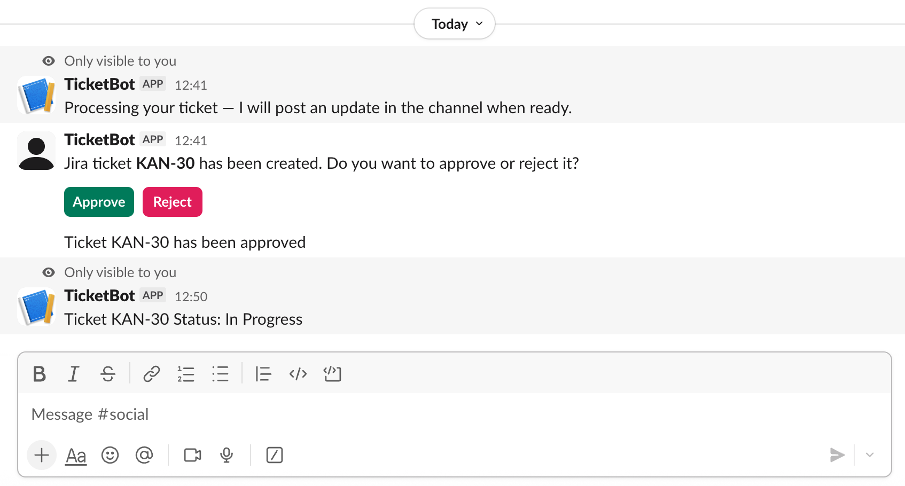

# AI Ticket Agent

## Project overview

This project listens for Slack slash commands and interactive button actions, creates Jira issues, and records a local ticket log. The primary goals are:

- Create Jira issues from Slack (`/ticket`).
- Query Jira issue status (`/ticket_status`).
- Present approval/rejection interactive buttons in Slack and record the result.



The service is intentionally small and easy to adapt. It is implemented with FastAPI and uses `httpx` for async HTTP to Jira and `slack_sdk` AsyncWebClient for Slack.

## Architecture & important files

- `main.py` — FastAPI application, Slack endpoints (`/slack/command`, `/slack/actions`, `/slack/events`).
- `jira.py` — Jira API helpers for creating issues and fetching issue status.
- `slack.py` — Slack helper to post messages and construct the approval block.
- `llm.py` — ticket classifier: tries a local ggml/GGUF model first (via `llama-cpp-python`) and falls back to OpenAI chat completions if no local model is available; normalizes output to one of the labels: Task, Bug, Incident, Feature Request, Question.
- `db.py` — SQLAlchemy engine/session factory and `init_db()` function.
- `models.py` — SQLAlchemy ORM model `TicketLog`.
- `config.yml` — YAML config file with Jira base URL, email, project key.
- `requirements.txt` — Python dependencies used by the project.

## Requirements

- Python 3.10+ recommended
- The project uses a virtual environment. Install dependencies from `requirements.txt`.

## Configuration

1. `config.yml` (checked into repo) contains basic values read at runtime. Example:

```yaml
JIRA_BASE_URL: https://your-domain.atlassian.net
JIRA_EMAIL: you@example.com
JIRA_PROJECT_KEY: KAN
```

2. Environment variables (recommended to set in a `.env` file or system env):

- `JIRA_API_TOKEN` — API token for Jira (used with `JIRA_EMAIL` for basic auth).
- `SLACK_BOT_TOKEN` — Slack bot token used by `slack_sdk`.
- `OPENAI_API_KEY` — (optional) API key used by `llm.py` if you enable classification.

Place a `.env` file in the project root with entries like:

```
JIRA_API_TOKEN=your_jira_api_token
SLACK_BOT_TOKEN=xoxb-...
OPENAI_API_KEY=sk-...
```

Notes:

- `config.yml` is read by `jira.py`. Update `JIRA_BASE_URL` and `JIRA_EMAIL` there. 
- Project-specific IDs (project id / issue type id) are currently passed to `create_jira_issue` from `main.py` as numeric strings (e.g. `"10000"`), so you'll need to either find those numeric ids in your Jira instance or modify the helper to use `project key` instead.

## Running locally

1. Create and activate a virtual environment (example):

```bash
python -m venv .venv
source .venv/bin/activate
python -m pip install -r requirements.txt
```

2. Create the SQLite database and tables (the app calls `init_db()` on startup, but you can also run a short script to ensure the DB exists):

```bash
python -c "from db import init_db; init_db()"
```

3. Run the app:

```bash
uvicorn main:app --host 0.0.0.0 --port 8000 --reload
```

4. Expose the server to Slack for development (optional) using `ngrok` or similar so Slack can reach your `/slack/command` and `/slack/actions` endpoints.

## Slack commands and interactive flows

- `/ticket <summary>` — Creates a Jira issue with the provided summary and description.
  - `main.py` currently uses `create_jira_issue(summary, description, project_id, issue_type_id)` and then stores the returned Jira `key` in the local DB as both `ticket_id` and `jira_issue_key`.
  - After creation the service posts an approval block to the same Slack channel.

- `/ticket_status <ISSUE-KEY>` — Fetches the status of the Jira issue using `get_jira_status` and posts the status back to the channel.

- Interactive approval buttons — When a user presses Approve/Reject the `/slack/actions` endpoint updates the `status` column in the `ticket_logs` table.

Note: Slack interactive payloads are handled for both `application/json` and form-encoded `payload` strings.

## Jira integration details & important behaviour

- `jira.py` authenticates using Basic auth with Jira email and API token. It builds requests against `{JIRA_BASE_URL}/rest/api/3/...`.
- When creating issues it constructs an Atlassian Document Format (ADF) description and posts a JSON payload to create an issue.
- Jira's issue key numbering is controlled by Jira. Deleting issues does not reuse their numeric sequence. If you delete issues in a project you will see gaps in numbers; new issues will continue increasing. This behavior is standard for Jira Cloud/Server.

IDs vs Keys:

- The project currently passes numeric `project_id` and `issue_type_id` into `create_jira_issue`. Many Jira APIs accept `project.key` (string) as well as numeric ids. If you prefer to use project key, modify `build_jira_payload` in `jira.py` to include `"project": {"key": "KAN"}` instead of `{"id": project_id}`.

Resetting numbering:

- To start issue numbering from 1 you must create a new project (different key) inside the same Jira instance — its numbering starts at 1. Recreating an existing project key or resetting numbering requires destructive operations or DB-level changes and is not recommended.

## Database

- SQLite file: `tickets.db` (created in repo root by SQLAlchemy engine). The `db.py` uses `sqlite:///tickets.db`.
- Table: `ticket_logs` defined in `models.py`:

  - id (PK)
  - slack_user
  - slack_channel
  - ticket_id (stored Jira key)
  - jira_issue_key
  - llm_result
  - status
  - created_at

The app writes a `TicketLog` entry whenever a ticket is successfully created.

## Troubleshooting & tips

- Slack "channel_not_found" or "not_in_channel": ensure the bot is invited to the channel and `SLACK_BOT_TOKEN` has scopes `chat:write`, `channels:read`, `conversations:open` as needed.
- Jira create failing: `jira.py` prints the payload and the Jira response. Look for `status` and response `json` printed to the logs. Ensure `JIRA_API_TOKEN` and `JIRA_EMAIL` are correct and the account has permission to create issues in the target project.
- Invalid blocks in Slack: `slack.py` logs block payloads and types. Use these logs to debug malformed block structures.
- If Jira returns HTML or non-JSON on error `jira.py` will print raw response bytes to help debugging.

## Quick checklist to adapt or reconfigure the project

1. Update `config.yml` with your `JIRA_BASE_URL` and `JIRA_PROJECT_KEY`.
2. Set environment variables in `.env` (`JIRA_API_TOKEN`, `SLACK_BOT_TOKEN`, optional `OPENAI_API_KEY`).
3. Ensure the Slack app has the correct request url set to your ngrok/public URL.
4. Start the app(FastAPI) with `uvicorn main:app` and test `/ticket` and `/ticket_status` from Slack.

## Using a free local ggml model (offline LLM)

The repository now includes an `llm.py` classifier that will try a local ggml/GGUF model first (via `llama-cpp-python`) and fall back to OpenAI chat completions if no local model is available. The LLM output is normalized to one of five labels: Task, Bug, Incident, Feature Request, Question.

What is implemented
- `GGML_MODEL_PATH` in your `.env` points to a local model file (ggml/.bin or .gguf). If present, `llm.classify_ticket` runs the local model (non-blocking via a background thread) and extracts a single label.
- If no local model is found or loading fails, `llm.py` falls back to OpenAI (if `OPENAI_API_KEY` is set).
- The classifier enforces the allowed labels in code (post-processing). Any unexpected reply is normalized or falls back to `Task`.
- `main.py` maps the LLM label to a Jira Issue Type name (configured mapping) and uses `JIRA_PROJECT_KEY` when creating issues.

Quick setup

1. Install llama-cpp-python

2. Place a local ggml/GGUF model in `models/` (example names: `orca-mini-3b-gguf2-q4_0.gguf`).

3. Set `GGML_MODEL_PATH` in your `.env` (use an absolute or project-relative path):

```properties
GGML_MODEL_PATH=./models/orca-mini-3b-gguf2-q4_0.gguf
OPENAI_API_KEY=your-openai-key  # optional fallback
```

How labels are enforced
- The classifier prompt instructs the model to return ONLY one of the five labels. The code then normalizes the first line of the reply and matches it (exact/prefix/contains) against the allowed list. If nothing matches, it falls back to `Task` and logs the raw reply for inspection.

Mapping labels to Jira Issue Types
- `main.py` contains a `label_to_issue_type` mapping that translates classifier labels into the Jira Issue Type name used when creating an issue. Make sure the names match exactly the Issue Type names in your project (case-sensitive). Example mapping in `main.py`:

```python
label_to_issue_type = {
  "Task": "Task",
  "Bug": "Bug",
  "Incident": "Incident",
  "Feature Request": "Task",
  "Question": "Question",
}
```

Testing
- Start the FastAPI app and invoke the Slack `/ticket` command (wired to your instance) to exercise the full flow. The created Jira issue will include the LLM-determined issue type.
- Or run a quick Python snippet to call the classifier directly:

```python
from llm import classify_ticket
import asyncio

print(asyncio.run(classify_ticket('My app crashes on startup when saving.')))
```

Notes & tips
- Model formats: `llama-cpp-python` supports GGUF/ggml formats. Verify the model file is a binary (not an HTML download page). Use `file` and `ls -lh` to check.
- Licensing: check the model license before use (some models require acceptance on Hugging Face).
- Hardware: quantized 7B models run on many laptops but still need several GB of RAM; larger models require more resources.
- If you prefer a different local runtime (for example `gpt4all`), the code can be adapted.

